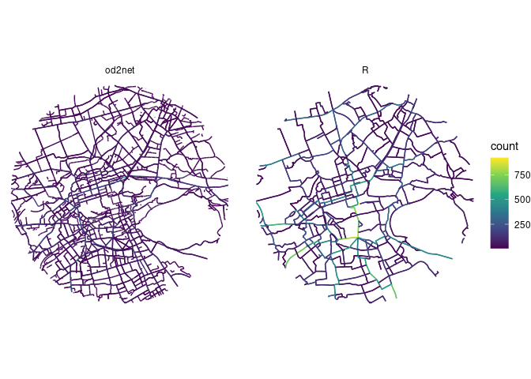

# Demo of od2net


The in this repo is intended to demonstrate how to use
[`od2net`](https://github.com/Urban-Analytics-Technology-Platform/od2net)
to generate route networks and to compare the workflow, and results,
with the R-based approach currently used in the NPT project.

# od2net minimum example

The following is based on [`od2net`’s
docs](https://github.com/Urban-Analytics-Technology-Platform/od2net/blob/main/docs/tutorial_examples.md#running-the-edinburgh-example)
and the code in the examples/edinburgh folder.

Setup the files in the input folder as follows:

``` r
source("R/setup.R")
main()
```

Run the tool with Docker as follows:

``` bash
docker run -v $(pwd):/app ghcr.io/urban-analytics-technology-platform/od2net:main /app/config.json
```

After that you should see the following in the output folder:

``` r
fs::dir_tree("output")
```

    output
    ├── counts.csv
    ├── output-r.geojson
    ├── output.geojson
    └── rnet.pmtiles

## R minimum example

``` r
library(tidyverse)
od = readr::read_csv("input/od.csv")
zones = sf::read_sf("input/zones.geojson")
desire_lines = od::od_to_sf(od, zones)
```

``` r
# Requires API key:
routes = cyclestreets::batch(desire_lines, username = "robinlovelace", wait = TRUE)
rnet = stplanr::overline(routes, attrib = "count")
sf::write_sf(rnet, "output/output-r.geojson")
```

## Comparison

``` r
output_od2net = sf::read_sf("output/output.geojson")
output_r = sf::read_sf("output/output-r.geojson")
sum(sf::st_length(output_od2net))
```

    2432481 [m]

``` r
sum(sf::st_length(output_r))
```

    1192642 [m]

``` r
names(output_od2net)
```

     [1] "backward_cost"     "count"             "destination_count"
     [4] "forward_cost"      "length"            "lts"              
     [7] "nearby_amenities"  "node1"             "node2"            
    [10] "origin_count"      "osm_tags"          "slope"            
    [13] "way"               "geometry"         

``` r
names(output_r)
```

    [1] "count"    "geometry"

``` r
summary(output_od2net$way)
```

         Min.   1st Qu.    Median      Mean   3rd Qu.      Max.      NA's 
    1.370e+02 5.368e+06 7.098e+07 2.546e+08 3.613e+08 1.313e+09     13596 

``` r
sum(output_od2net$count * sf::st_length(output_od2net), na.rm = TRUE) |>
  units::set_units("km")
```

    11740.47 [km]

``` r
sum(output_r$count * sf::st_length(output_r), na.rm = TRUE) |>
  units::set_units("km")
```

    83155.09 [km]

``` r
# Vs flow implied from desire lines (expectation: ~1.3 x this amount):
sum(desire_lines$count * sf::st_length(desire_lines), na.rm = TRUE) |>
  units::set_units("km")
```

    30394.87 [km]

``` r
output_combined = bind_rows(
  output_od2net |>
    filter(!is.na(way)) |>
    # Only large counts:
    filter(count > 5) |>
    mutate(source = "od2net"),
  output_r |>
    mutate(source = "R") |>
    filter(count > 5)
)
central_edinburgh = zonebuilder::zb_zone("Edinburgh", n_circles = 2)
output_combined = output_combined |>
  sf::st_intersection(central_edinburgh)
output_combined |>
  ggplot() +
  geom_sf(aes(colour = count)) +
  scale_colour_viridis_c() +
  facet_wrap(~source) +
  theme_void()
```



## Setup

<details>

Run the code on a computer with Ubuntu 22.04 after running the setup
outlined in the link above.

``` bash
gh repo clone Urban-Analytics-Technology-Platform/od2net
# Copy the example to this folder:
cp -r od2net/examples/edinburgh/* .
cp -r od2net/
```

``` bash
# Setup quarto-publish:
```
